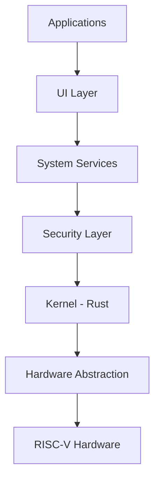

<div align="center">


<br/>

## सुरक्षा OS

**India’s Sovereign Mobile Operating System**

<br/>


<br/><br/>

> **Not a fork. Not a layer. A ground-up operating system.**

<br/>

[⭐ Star](https://github.com/IamTamheedNazir/SurakshaOS) •
[🐛 Issues](https://github.com/IamTamheedNazir/SurakshaOS/issues) •
[💬 Discord](https://discord.gg/suraksha-os)

</div>

---

## Overview

SurakshaOS is a **ground-up mobile operating system** built in Rust, targeting RISC-V architecture.

It is designed for:

* Sovereignty
* Security
* Long-term independence

No Android base. No iOS components. No external control layers.

---

## Core Principles

* **Sovereignty** — full control over the stack
* **Security-first design** — minimal attack surface
* **Memory safety** — Rust-based implementation
* **Transparency** — open and auditable

---

## Current Status (v0.2.0)

### Implemented

* Kernel boot (Rust)
* Basic memory management
* Hardware abstraction layer
* Cryptographic primitives
* Minimal system interface

### In Progress

* Telephony stack
* Power management
* Application runtime
* OTA updates

---

## Architecture



---

## Roadmap

```text
v0.3  → Stable kernel + improved memory management  
v0.5  → System services + device boot prototype  
v0.7  → Minimal runtime environment  
v1.0  → Functional mobile OS prototype  
```

---

## Contributing

Contributions are welcome in:

* Systems programming (Rust/C)
* Operating systems
* Embedded systems
* Security & cryptography

---

## License

GPLv3 — open, transparent, community-driven.
