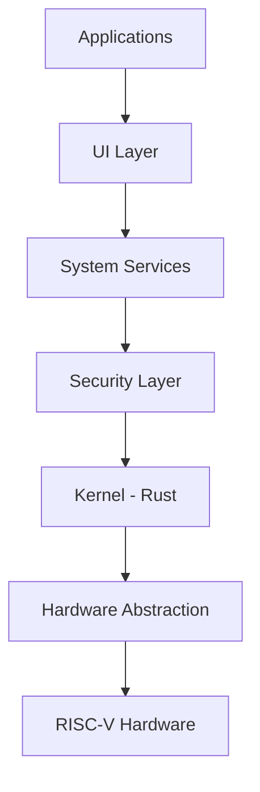

<div align="center">


<br/>

## सुरक्षा OS

**India's Sovereign Mobile Operating System**

<br/>


<br/><br/>

> **Not a fork. Not a layer. A ground-up operating system.**

<br/>

[⭐ Star](https://github.com/IamTamheedNazir/SurakshaOS) •
[🐛 Issues](https://github.com/IamTamheedNazir/SurakshaOS/issues) •
[💬 Discord](https://discord.gg/suraksha-os)

</div>

---

## Overview

SurakshaOS is a **ground-up mobile operating system** built in Rust, targeting RISC-V architecture.

It is designed for:

* Sovereignty
* Security
* Long-term independence

No Android base. No iOS components. No external control layers.

> **⚠️ Current State:** This is an early-stage prototype. The kernel boots on QEMU, provides an interactive shell with basic filesystem commands, and has a timer interrupt. It does NOT yet have virtual memory, process isolation, a scheduler, persistent storage, networking, or any graphical interface. See [Current Status](docs/CURRENT_STATUS.md) for an honest audit.

---

## What Works (v0.2.0-alpha)

* ✅ **Kernel boot** — boots on `qemu-system-riscv64 -machine virt`
* ✅ **UART console** — NS16550A polling driver with print macros
* ✅ **Heap allocator** — `linked_list_allocator` providing Rust `alloc`
* ✅ **Timer interrupt** — CLINT timer with tick counting
* ✅ **In-memory VFS** — directory tree with file CRUD operations
* ✅ **Interactive shell** (`sursh`) — ~20 built-in commands
* ✅ **Boot assembly** — BSS clearing, stack setup, single-core boot

## What Does NOT Work Yet

* ❌ No real processes — everything runs in one call stack
* ❌ No virtual memory or page tables
* ❌ No scheduler or preemption
* ❌ No persistent storage (all data lost on reboot)
* ❌ No user/kernel mode separation (everything in M-mode)
* ❌ No networking
* ❌ No graphics or GUI
* ❌ No cryptographic implementations
* ❌ No capability system (currently simulated)
* ❌ No tests or CI

---

## Building

### Prerequisites

```bash
# Install Rust nightly
rustup install nightly
rustup component add rust-src --toolchain nightly

# Install QEMU (Ubuntu/Debian)
sudo apt install qemu-system-misc

# Or on macOS
brew install qemu
```

### Build

```bash
# Build the kernel
cd kernel
cargo build --release

# Or use the Makefile
make build
```

### Run in QEMU

```bash
make run
```

This boots SurakshaOS on QEMU RISC-V virt with 256 MiB RAM and drops you into the `sursh` shell.

### Shell Commands

```
help      — Show available commands
ls [path] — List directory contents
cd <dir>  — Change directory
pwd       — Print working directory
cat <file>— Print file contents
echo      — Print text
mkdir     — Create directory
touch     — Create file
write     — Write text to file
rm        — Remove file
ps        — List processes (simulated)
mem       — Show memory usage
uptime    — Show system uptime
uname     — Show OS information
env       — Show environment variables
export    — Set environment variable
clear     — Clear screen
reboot    — Reboot system
halt      — Halt system
```

---

## Architecture

See [docs/ARCHITECTURE.md](docs/ARCHITECTURE.md) for the full architecture document.


```mermaid
flowchart TD
    A[Applications] --> B[UI Layer]
    B --> C[System Services]
    C --> D[Security Layer]
    D --> E[Kernel - Rust]
    E --> F[Hardware Abstraction]
    F --> G[RISC-V Hardware]
```

---

## Roadmap

See [docs/ROADMAP.md](docs/ROADMAP.md) for the full prioritized roadmap.

| Milestone | Description | Status |
|-----------|-------------|--------|
| M0 | Bootable Prototype | ✅ Done |
| M1 | Correct Kernel Foundation | 🔄 In Progress |
| M2 | Real Kernel (processes, VM, scheduler) | ⏳ Pending |
| M3 | Persistent OS (filesystem, ELF loader) | ⏳ Pending |
| M4 | Secure OS (capabilities, crypto) | ⏳ Pending |
| M5 | Networked OS (TCP/IP stack) | ⏳ Pending |
| M6 | Graphical OS (compositor, UI) | ⏳ Pending |
| M7 | Mobile OS (touch, sensors, battery) | ⏳ Pending |
| M8 | App Platform (SDK, package manager) | ⏳ Pending |

---

## Documentation

* [Current Status](docs/CURRENT_STATUS.md) — honest component audit
* [Architecture](docs/ARCHITECTURE.md) — system architecture
* [Roadmap](docs/ROADMAP.md) — prioritized milestones
* [Technical Debt](docs/TECHNICAL_DEBT.md) — known issues and debt
* [Security Architecture](docs/SECURITY_ARCHITECTURE.md) — security design (planned)
* [Memory Architecture](docs/MEMORY_ARCHITECTURE.md) — memory design (planned)
* [Syscall ABI](docs/SYSCALL_ABI.md) — syscall interface (planned)
* [Hardware Support](docs/HARDWARE_SUPPORT.md) — supported hardware (planned)

---

## Contributing

Contributions are welcome. See [CONTRIBUTING.md](CONTRIBUTING.md) for setup and guidelines.

**Priority areas:**
* Systems programming (Rust/C)
* Operating systems / RISC-V
* Security & cryptography
* Embedded systems
* Documentation

---

## Core Principles

* **Sovereignty** — full control over the stack
* **Security-first design** — minimal attack surface
* **Memory safety** — Rust-based implementation
* **Transparency** — open and auditable
* **Honesty** — documented state matches actual code

---

## License

GPLv3 — open, transparent, community-driven. See [LICENSE](LICENSE) for details.
